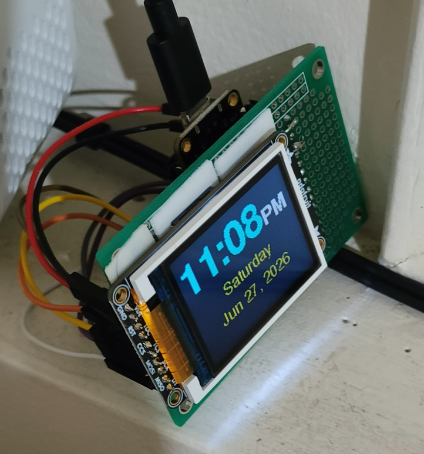
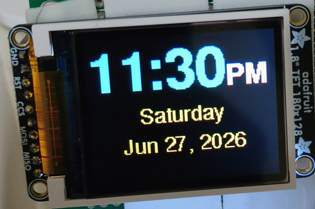

# NTP Desk Clock



A WiFi-synced desk clock built with the Adafruit ESP32 Feather V2 and ST7735 TFT display. Displays time and date with automatic brightness dimming at night. WiFi credentials are configured via a captive portal on first boot - no hardcoded passwords.


## Features

- **Captive portal WiFi setup** — no credentials in code, configure from your phone
- **NTP time sync** — accurate time from `pool.ntp.org`, no RTC module needed
- **12/24-hour format** with AM/PM indicator
- **Full date display** — day of week, month, day, year
- **Auto brightness** — dims backlight at night (10 PM – 6 AM)
- **Timezone configurable** — GMT offset + daylight saving support
- **WiFi auto-reconnect** — handles dropped connections gracefully
- **FreeFont rendering** — clean, anti-aliased text

## Hardware

### Bill of Materials

| Qty | Component | Notes |
|-----|-----------|-------|
| 1 | [Adafruit ESP32 Feather V2](https://www.adafruit.com/product/5400) | WiFi, Micro-USB, CP2104 UART |
| 1 | ST7735 1.8" TFT (128×160) | SPI, 3.3V logic |
| 8 | Jumper wires | Female-to-male or as needed |
| 1 | Micro-USB cable | Power + programming |
| 1 | Breadboard | For prototyping (optional for final build) |

### Wiring

| ST7735 Pin | Signal | Feather V2 Pin | GPIO | Notes |
|-----------|--------|---------------|------|-------|
| VCC | Power | 3V | — | 3.3V supply |
| GND | Ground | GND | — | Common ground |
| SCK | SPI Clock | SCK | 5 | Hardware SPI (VSPI) |
| SDA | SPI Data (MOSI) | MOSI | 19 | Hardware SPI (VSPI) |
| CS | Chip Select | A1 | 27 | Any digital GPIO works |
| RST | Reset | A9 | 33 | Any digital GPIO works |
| DC / A0 | Data/Command | A3 | 15 | Any digital GPIO works |
| LITE | Backlight | A7 | 32 | PWM for brightness control |


## First Boot

1. Flash the firmware (see Build section below)
2. The display shows **"Connect to NTP-Clock-Setup AP"**
3. On your phone, join the **NTP-Clock-Setup** WiFi network
4. A captive portal opens — select your home WiFi and enter the password
5. The ESP32 connects, syncs time via NTP, and displays the clock
6. Credentials are saved in flash — survives power cycles and reflashes

To change WiFi later, erase flash with `pio run -t erase` and reflash.

## Build

### PlatformIO (Recommended)

```bash
cd firmware
pio run -t upload
pio device monitor
```

### Arduino IDE (Not tested, for reference only)

1. **Board support:** File → Preferences → add to Additional Board Manager URLs:
   ```
   https://espressif.github.io/arduino-esp32/package_esp32_index.json
   ```
   Then Tools → Boards Manager → install **esp32 by Espressif**

2. **Select board:** Tools → Board → **Adafruit Feather ESP32 V2**

3. **Install libraries** (Library Manager):
   - `Adafruit GFX Library`
   - `Adafruit ST7735 and ST7789 Library`
   - `WiFiManager` by tzapu

4. Open `firmware/src/main.ino` and upload

## Configuration

Settings are in `firmware/include/config.h`:

```cpp
// Timezone: seconds offset from GMT
#define GMT_OFFSET_SEC    -6 * 3600   // CST (UTC-6)
#define DST_OFFSET_SEC    3600        // +1h for CDT

// Display brightness (0–255)
#define BRIGHTNESS_DAY    200
#define BRIGHTNESS_NIGHT  40
#define NIGHT_START_HOUR  22          // 10 PM
#define NIGHT_END_HOUR    6           // 6 AM

// Time format
#define USE_24H_FORMAT    false       // true for 24-hour
```

WiFi credentials are **not** stored in config — they're entered via the captive portal at runtime.

### Common Timezone Offsets

| Timezone | `GMT_OFFSET_SEC` | `DST_OFFSET_SEC` |
|----------|-----------------|-----------------|
| US Eastern (EST/EDT) | `-5 * 3600` | `3600` |
| US Central (CST/CDT) | `-6 * 3600` | `3600` |
| US Pacific (PST/PDT) | `-8 * 3600` | `3600` |
| India (IST) | `5.5 * 3600` | `0` |
| UK (GMT/BST) | `0` | `3600` |
| Japan (JST) | `9 * 3600` | `0` |

## Display Layout



## License

MIT — see [LICENSE](LICENSE) for details.

## Acknowledgments

- [Adafruit GFX Library](https://github.com/adafruit/Adafruit-GFX-Library)
- [Adafruit ST7735 Driver](https://github.com/adafruit/Adafruit-ST7735-Library)
- [WiFiManager](https://github.com/tzapu/WiFiManager)
- Time sync via [pool.ntp.org](https://www.ntppool.org/)
